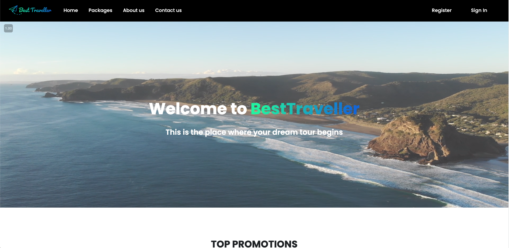
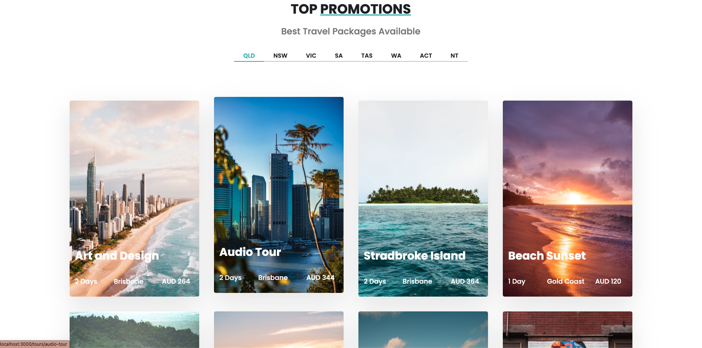
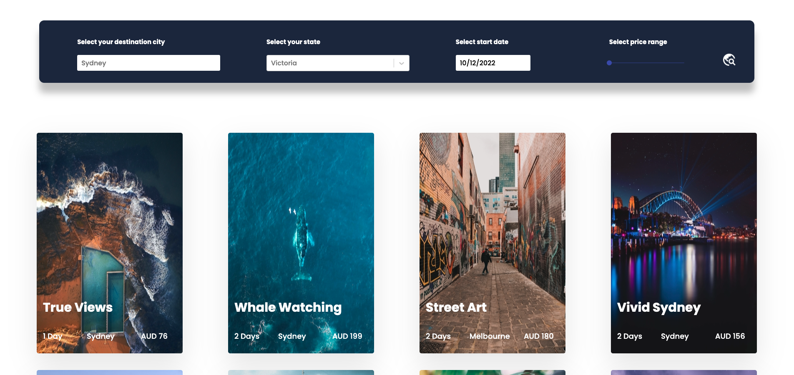

# Project introduction

## Best Traveller

Best traveller website is an online booking travel platform, which allows customers to find their favorite travel route on the platform and clients can make booking online. The platform was decided to help clients with personalized travel itineraries, unbiased advice of travel options and excellent value to travellers.

# Key Features

- Authentication
- Reset password
- Update personal infomation
- Search and filter travel packages
- Book travel packages
- Payment via stripe payment integration
- Check paid travel packages
- Rate and comment the travel package
- Check given rates and comments

# Tech Stack

Front-end:

- Library: React.js Redux, React router, Styled Component
- Payment: Stripe
- Validation: Yup, Formik
- Alert banner: Sweetalert
- Map: Mapbox
- Middleware: Redux-thunk,
- Storage: Redux-persist

Back-end:

- Library: Express
- Encryption: Bcryptjs, Crypto
- Cross-domain: Cors
- Email: Slugify, Nodemailer
- Image uploader: sharp
- Validation: Express-validator
- Authentification: Jsonwebtoken
- Database: Mongoose

# Prerequisites

Node.js environment

# Setup

`npm install`  
`npm start`  

## Backend
`Always run backend first!`   
`backend:`  
`1. add dotenv file to enable connection with mongodb`   
`2. node app.js`   
`2. npm start`   

## Frontend
`frontend: src config.js need to edit api address`  
`1. frontend -> Src -> config.js need to change to correct api address`  
`2. after backend running on port: 8000 successfully, npm start frontend`  

# Website Preview
<h4>Homepage</h4>

  

<h4>Promotion section</h4>

<h4>Packages page</h4> 

<h4>Tour details</h4>

<h4>Forgot Password page</h4>

<h4>Contact us page</h4>

# Coding Standard

- Eslint - Airbnb
- CamelCase

# Test

- Jest
- Supertest

# Contributing

- yangliu0327 (yangliuwork0327@qq.com)
- elbert.fang (elbert.fang@outlook.com)
- SophieSun (sophiesun.au@gmail.com)
- KyrieWen (sijiewenunsw@gmail.com)
- Bob Qin (qinjiabo1990@gmail.com)
- Nan Guo (guonan627@hotmail.com)
- Zhang-Haoran (haoranbackup4@gmail.com)
